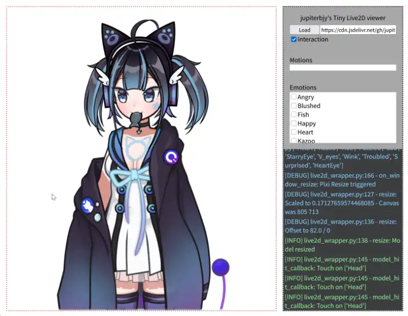
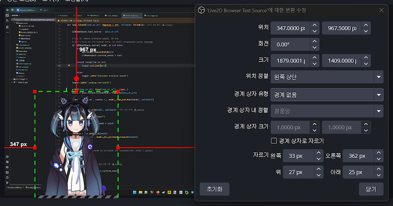
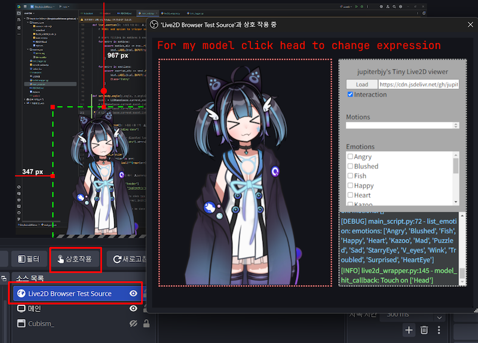

# Simple Live2d Viewer

  
  
  

Simple Web based Live2d viewer using [pixijs](https://github.com/pixijs/pixijs) and [pixi-live2d-display](https://github.com/guansss/pixi-live2d-display), therefore naturally supporting all SDK 2/3/4.

Created to provide fixed URL directly leading to interactive preview for live2d models without manual URL copy-pasting.

This is hosted thru [github.io](https://jupiterbjy.github.io/SimpleLive2dViewer/).

# Usage

Just use url like this:
`[URL]?[link_to_model_json]`

```
http://jupiterbjy.github.io/SimpleLive2dViewer/?https://cdn.jsdelivr.net/gh/guansss/pixi-live2d-display/test/assets/shizuku/shizuku.model.json
```

And either open it in browser or even use it in OBS - Though feature for the latter usecase is severely lacking.

# Examples

- [Example 1][1] - URL from pixi-live2d-display, Cubism's official model

- [Example 2][2] - Self made [Live2D fanart](https://github.com/jupiterbjy/Live2DPractice-Cyannyan) of Cyannyan


| ![][3] | ![][4] |
|--------|--------|
| ![][5] |        |


[1]: https://jupiterbjy.github.io/SimpleLive2dViewer/?https://cdn.jsdelivr.net/gh/guansss/pixi-live2d-display/test/assets/shizuku/shizuku.model.json
[2]: https://jupiterbjy.github.io/SimpleLive2dViewer/?https://cdn.jsdelivr.net/gh/jupiterbjy/Live2DPractice-Cyannyan/CyanSDLowRes/CyanSD.model3.json
[3]: https://github.com/jupiterbjy/SimpleLive2dViewer/assets/26041217/762d79c0-342d-45b3-8361-f8af65635d67
[4]: https://github.com/jupiterbjy/SimpleLive2dViewer/assets/26041217/6996011a-bc66-4af3-80ef-6283ca9738c8
[5]: https://github.com/jupiterbjy/SimpleLive2dViewer/assets/26041217/54b487ec-946a-4982-8ec4-344b169ba8ec
